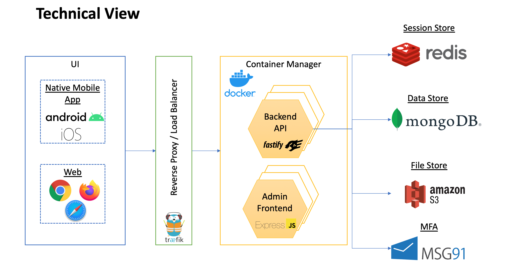

# Architecture document for civicsense/corona monitoring application

This document describes the high level component architecture for the civicsense_students application.

## Requirements

The application aims to acheive the following:
- A medium to crowdsource information from the citizens at a time of disasters, so authorities can get actionable information from its citizens
- To imbibe civic sense in young minds by encouraging the reporting of civic issues in their locality

## Motivation

The main motivation of the application is to cater to the requirements of the following 2 user Personas. This also being a volunteer led initiative, some decisions were made with the cost constraints in mind, but following the layered architecture practices.

### Admin
- Authenticate only specific users as Admin
- As an Admin, it should provide an interface to define campagins for specific location for a given period of time.
- Ability to Approve/Reject the user submission
- Get a Report based on the Campaign/Location

### User
- Register user and make any user login to the application in an easy way
- Make it easy for the user to click and share information in an intutive and easy to use interface

## Architecture components

The application follows a Layered architecture approach. The Logical view explains the different layers defined for the application

## Logical View

### Presentation Layer
The presentation for the User Persona will be native mobile App. The native mobile app provides a seamless integration with the camera and location apps in the user's smartphone. The app will also provide a native experience for the user.

The Admin persona will be primarily be used by the authorities and the best mechanism to access it would be a web application that is accessed via a computer/laptop. This will also help in managing and viewing reports.

### Application/Business Logic Layer
The business layer will host the Backend application that exposes REST API for the Presentation layer. The Business Logic API will cater to the following requirements
- Campaigns definition by admin 
- User details and the data uploaded
- Admin reporting, approval/rejection of user uploaded data
- Leaderboard to identify leader for the campaigns

### Persistence Layer
The persistence layer caters to the following
- A quick access session store for maintaining user sessions
- Data store for persisting the application data
- A file store to store the images uploaded by the user

### Reverse Proxy/Load Balancer
The Reverse proxy helps in decoupling the UI with the business layer. With this decoupling, the Business API services can be dynamically scaled up or down based on the load. This also enables decomposing the backend api to multiple services in future.

This also helps in enforcing security measures like IP based filtering, request throttling etc.

### Security
User authorization is handled via OTP mechanism. Once authorized, the api sends a unique token to the client in response cookie. Every further request should contain the cookie
Admin login also uses a cookie based authorization, but the admin APIs are accessible only to Admin users.

## Technical View

The actual Technical view of the application based on the Logical View is shown below

