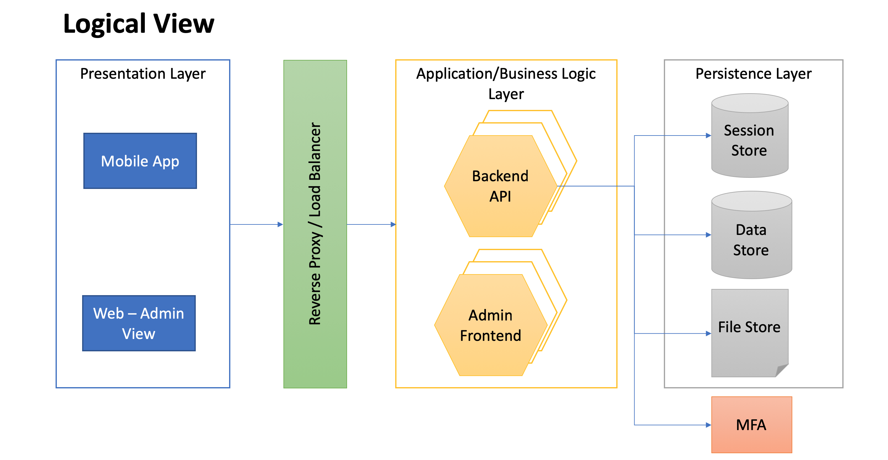

# Architecture document for civicsense/corona monitoring application

This document describes the high level component architecture for the civicsense_students application.

## Requirements

The application aims to acheive the following:
- A medium to crowdsource information from the citizens at a time of disasters, so authorities can get actionable information from its citizens
- To imbibe civic sense in young minds by encouraging the reporting of civic issues in their locality

## Motivation

The main motivation of the application is to cater to the requirements of the following 2 user Personas. This also being a volunteer led initiative, some decisions were made with the cost constraints in mind, but following the layered architecture practices.

### Admin
- Authenticate only specific users as Admin
- As an Admin, it should provide an interface to define campagins for specific location for a given period of time.
- Ability to Approve/Reject the user submission
- Get a Report based on the Campaign/Location

### User
- Register user and make any user login to the application in an easy way
- Make it easy for the user to click and share information in an intutive and easy to use interface

## Architecture components

The application follows a Layered architecture approach. The Logical view explains the different layers defined for the application

## Logical View

### Presentation Layer

### Application/Business Logic Layer

### Persistence Layer

### Reverse Proxy/Load Balancer

### Security

## Technical View

The actual Technical view of the application based is shown below

